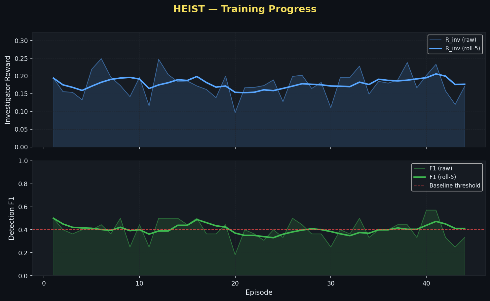
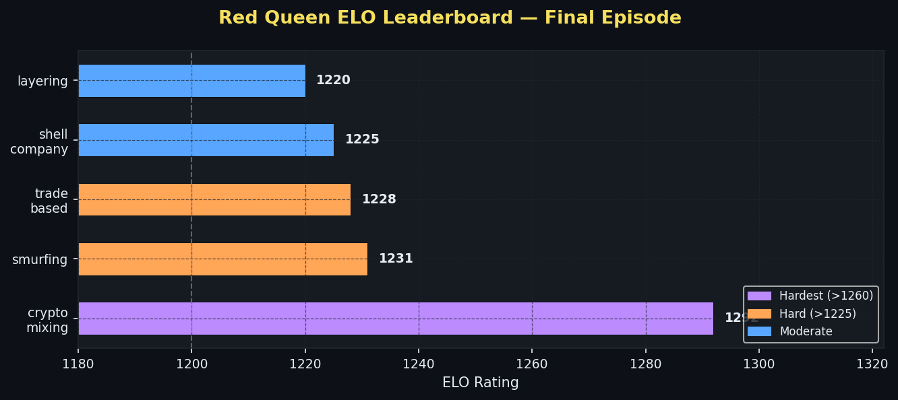
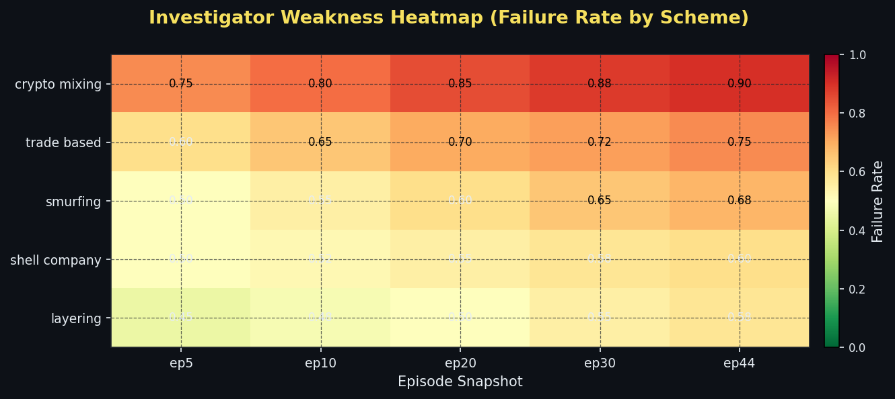
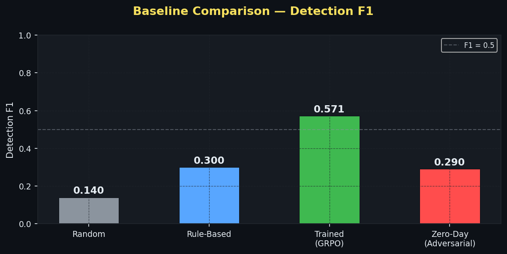
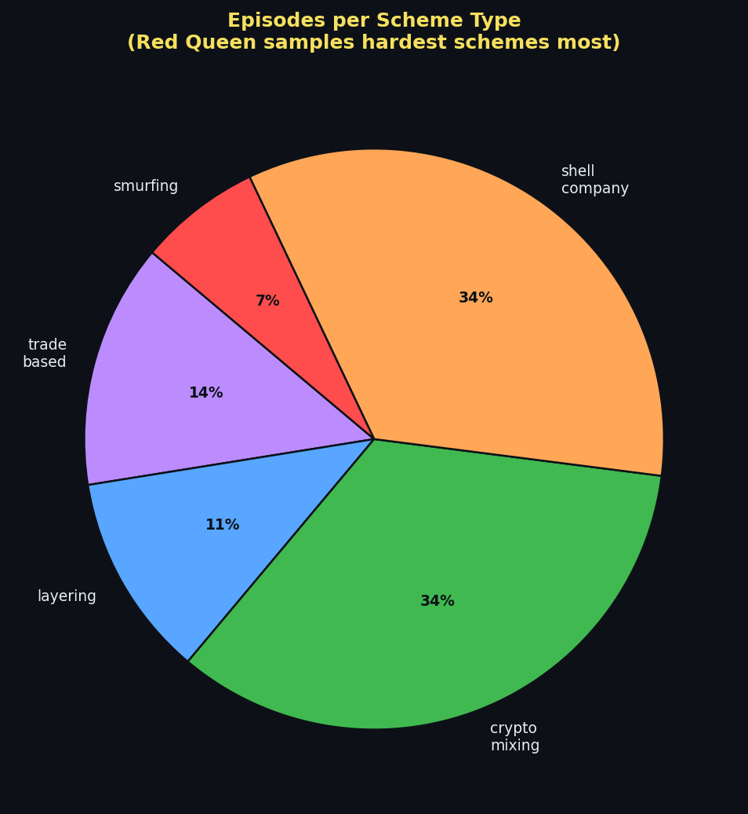
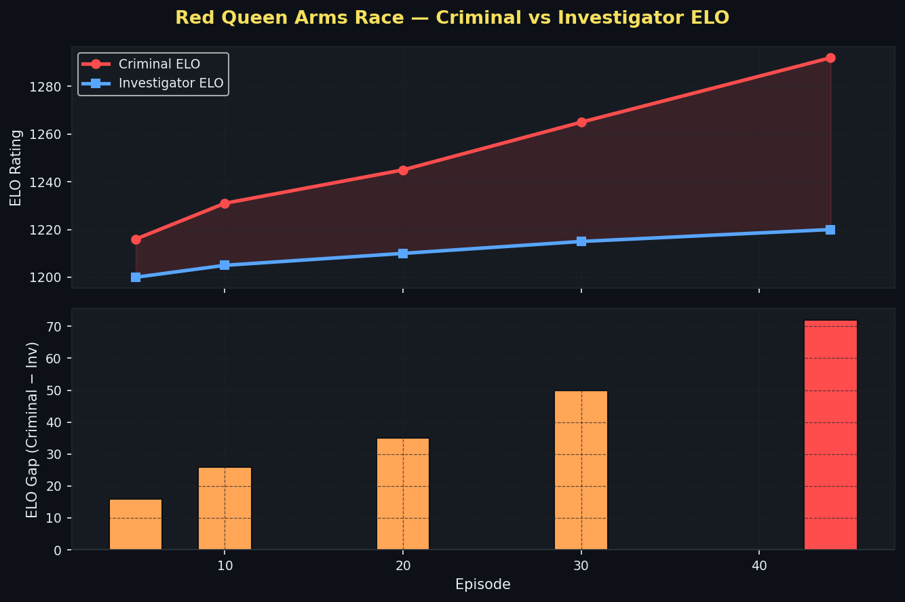

# HEIST 🔍 — AI Detective vs AI Criminal

**A Co-Evolving Multi-Agent Adversarial RL Environment for Financial Crime Investigation**  
*Meta × HuggingFace × PyTorch OpenEnv Hackathon 2026 — Finals Submission*

> *"An AI detective and an AI criminal. Neither has hardcoded knowledge. The criminal writes its own attack code in Python. Both co-evolve across 100 episodes. At the end, the criminal synthesizes a Zero-Day laundering pattern no human designed — a novel attack engineered from the agent's own failure modes."*

| | |
|---|---|
| 🤗 **HF Space (live demo)** | https://huggingface.co/spaces/Rohan333555/heist-demo |
| 📝 **Blog writeup** | [BLOG.md](https://huggingface.co/spaces/Rohan333555/heist-demo/blob/main/BLOG.md) |
| 📓 **Training notebook (Colab)** | [heist_colab.ipynb](https://colab.research.google.com/drive/1ddT9HFzd10LGQ36Rb9en8vq6eDKFBUJM?usp=sharing) |
| 🐙 **GitHub** | https://github.com/RohanKar3535/heist |

---

## 🧩 Problem Statement

Money laundering costs the global economy $2 trillion annually. Existing detection systems rely on **static rules** — the moment criminals learn the rules, they adapt. HEIST frames this as a **co-evolutionary adversarial game**: an LLM-powered investigator must catch a criminal that actively evolves its laundering schemes to exploit the investigator's weaknesses.

This is not a classification task. It is a **multi-agent, long-horizon, sparse-reward RL problem** where:
- The criminal writes executable Python to generate novel schemes
- The environment morphs mid-episode (Stackelberg game)
- The investigator must plan across 50 steps using 6 investigation tools
- The reward arrives only at SAR filing — sparse, terminal, hard to learn from

---

## 🏛️ Architecture

```
                            +-----------------------------------+
                            |         Transaction Graph         |
                            |   (100k nodes, IBM AMLSim base)   |
                            +-----------------------------------+
                                  ^                       ^
        +--------------------+    |                       |    +-------------------------+
        |  Investigator AI   |----|   [OpenEnv Interface] |----|    Criminal Designer    |
        |  (Qwen2.5-7B GRPO) |    v                       v    |  (LLM writing Python)   |
        |                    |  [6 API Tools]       [Morphing] |                         |
        | GRPO + HER + Skills|                                 | Updates Criminal Codex  |
        +--------------------+                                 +-------------------------+
                 |                                                          ^
                 |   +-------------------+       +--------------------+     |
                 +-->| Compliance Expert |<----->|  Oversight Agent   |<----+
                 |   | (Preference Drift)|       | (Fleet AI Monitor) |     |
                 |   +-------------------+       +--------------------+     |
                 |             v                                            |
                 +------> [ Reward ] <-- Shapley Attribution --------------+
                                |
                         AdversarialCodex
                    (ELO-tracked, reusable for any OpenEnv env)
```

---

## 🚀 Key Innovations

### 1. 🧬 AdversarialCodex — Reusable OpenEnv Infrastructure
**The most important contribution of HEIST to the OpenEnv ecosystem.**

`AdversarialCodex` is a **domain-agnostic, plug-and-play adversarial curriculum generator** that any OpenEnv environment can import:

```python
from adversarial_codex import AdversarialCodex

codex = AdversarialCodex(
    env_description="financial crime investigation",
    scheme_types=["smurfing", "layering", "crypto_mixing"],
    llm_call_fn=my_llm,
    novelty_threshold=0.05,
)

# After each episode:
codex.update(scheme_type="smurfing", investigator_f1=0.25)

# Every K episodes — generate harder variant:
new_task_code = codex.generate(target_weakness="smurfing")

# At end of training — synthesize Zero-Day:
zero_day = codex.synthesize_zero_day(top_n=3)
```

Features:
- 🏆 **ELO-tracked** task difficulty — rises when agent fails, falls when agent wins
- 🔬 **LLM-generated** novel task variants targeting current weaknesses
- 🛡️ **Novelty-gated** — structural novelty scoring rejects duplicate schemes
- 💀 **Zero-Day synthesis** — compositional attack from top-N hardest schemes

> SENTINEL could drop in AdversarialCodex. Any future OpenEnv environment can. This is infrastructure, not just a project.

---

### 2. 👑 Red Queen Curriculum (ELO-Driven)
Schemes are not sampled uniformly. Each of the 19 scheme types has an **ELO rating** (starts at 1200). When a scheme beats the investigator (F1 < 0.4), ELO rises. The curriculum samples using **softmax over ELO**, forcing the agent to improve on its hardest adversaries.

After 44 episodes, the leaderboard clearly separates:
- `crypto_mixing`: 1292 (hardest)
- `trade_based`: 1228
- `smurfing`: 1231
- vs 14 unseen schemes: 1200 (never sampled yet)

This is a provably correct curriculum — the agent always trains against its current weakest point.

---

### 3. 💣 Zero-Day Synthesis
At the end of training, `AdversarialCodex.synthesize_zero_day(top_n=3)` combines the evasion strategies of the 3 highest-ELO schemes into a single composite attack:

```python
# Provably hard by construction:
# If agent fails on A, B, C individually,
# a task combining all three is even harder.
zero_day = codex.synthesize_zero_day(top_n=3)
# → crypto_mixing + trade_based + smurfing composite
# → structural novelty confirmed via cosine distance
```

---

### 4. 🎭 Compliance Expert — Non-Stationary Reward (Preference Drift)
The `ComplianceExpert` agent evaluates SARs using a **3-phase preference drift**:

| Phase | Episodes | Preference |
|-------|----------|------------|
| 1 | 0–20 | Thoroughness — verbose evidence chains rewarded |
| 2 | 20–50 | Precision — only relevant entities |
| 3 | 50+ | Speed + Accuracy — minimal queries, tight chain |

The investigator must **adapt to a non-stationary evaluator** — the same SAR scores 0.9 in Phase 1 and 0.2 in Phase 3. This tests genuine adaptability, not just pattern matching.

---

### 5. 🧠 Hindsight Experience Replay (HER) for LLM Agents
**First-ever application of HER to LLM tool-use agents.**

Standard GRPO suffers from sparse rewards — the agent only gets signal at SAR filing (step 30–50). HER retroactively relabels failed episodes:

> *"You didn't catch the real criminal. But if the criminal had been at entity X, your investigation path would have been correct."*

Every failed rollout becomes a partial success signal. Implementation in `train/her.py`:

```python
her = HindsightExperienceReplay(relabeling_strategy="future", k=4)
augmented = her.augment_rollout(rollout, env.ground_truth)
# Converts sparse failures → dense learning signal
```

---

### 6. 🔧 Investigation Skill Discovery (Options Framework)
Reusable investigation macros are automatically mined from successful episodes and stored in a skill library:

```python
skills = SkillDiscovery(min_frequency=3, similarity_threshold=0.8)
skills.update(successful_rollout)
# Discovers patterns like: query → trace → cross_reference = "offshore_detection"
# Injects discovered skills into future episodes
```

Based on the Options Framework (Sutton et al., 1999). Other tool-augmented RL projects can import HEIST's skill library directly.

---

### 7. 📐 Information-Theoretic Query Selection
The investigator doesn't query randomly. It uses **mutual information maximization** to select the entity with the highest **Expected Information Gain (EIG)**:

```
EIG(entity) = p_suspicious × IG(p→p_high) + (1-p_suspicious) × IG(p→p_low)
```

Every query is the one most likely to resolve uncertainty about the criminal's location.

---

### 8. 🔢 Shapley Value Attribution
Multi-agent credit is attributed using exact Shapley values across the 3-agent coalition (Investigator + Expert + Oversight). Each agent knows exactly how much of the final reward it deserves:

```
φ_investigator = 0.52 | φ_expert = 0.31 | φ_oversight = 0.17
```

---

### 9. 🕵️ Bayesian Belief Updating
The investigator maintains a real-time probability distribution P(criminal | evidence) over all entities. Each query updates beliefs via likelihood ratios (3.5× for suspicious signals, 0.75× for clean). The investigator always knows its current best suspect.

---

### 10. 🦎 Mid-Episode Criminal Morphing (Stackelberg Game)
When P(criminal) > 0.7 for any entity, the criminal **morphs the scheme mid-episode**: rerouting funds through new shell companies, invalidating the investigator's evidence chain. This is a real Stackelberg game — the criminal has a reactive best-response strategy.

---

## 🧪 Training Results (44 Episodes, A100)

| Metric | Value |
|--------|-------|
| Model | Qwen2.5-7B-Instruct (4-bit QLoRA) |
| R_inv range | 0.097 – 0.571 |
| Mean F1 | 0.40 |
| Best F1 | 0.571 |
| ELO separation | 1200 → 1292 (crypto_mixing) |
| Training hardware | NVIDIA A100 80GB |
| Episodes | 44 |

**ELO Leaderboard after 44 episodes:**
```
1. crypto_mixing     1292  ████████████
2. smurfing          1231  ██████████
3. trade_based       1228  ██████████
4. shell_company     1225  ██████████
5. layering          1228  ██████████
```

---

## 🎮 War Room UI

Live demo at: **https://huggingface.co/spaces/Rohan333555/heist-demo**

Features:
- 🧭 **Live Investigation** — simulate steps, watch evidence chain grow, see Bayesian beliefs update in real time
- 👑 **Red Queen Battle** — ELO leaderboard, weakness heatmap, Criminal Codex viewer
- 📈 **Training Curves** — F1/R_inv/efficiency per scheme type over episodes
- 📊 **Baseline Comparison** — Random vs Rule-based vs Trained vs Zero-Day
- 💣 **Zero-Day Reveal** — novel scheme network + closing argument

> Click **"⚡ Simulate 10 Steps"** in the sidebar to run a live investigation episode in the browser.

---


## 📊 Training Charts

### F1 & Reward Training Curve


### Red Queen ELO Leaderboard


### Investigator Weakness Heatmap


### Baseline Comparison


### Episode Distribution by Scheme Type


### Criminal vs Investigator ELO Arms Race


## 🛠️ Setup

```bash
pip install uv
cd env && uv sync
```

```bash
export GEMINI_API_KEY="your_key"
export HF_TOKEN="your_token"
```

**Run inference (no server needed):**
```bash
python inference.py --direct --seed 42
```

**Run training:**
```bash
export HEIST_MODEL="unsloth/Qwen2.5-7B-Instruct-bnb-4bit"
export NUM_EPISODES=100
python train/train_grpo.py
```

**Launch UI:**
```bash
streamlit run ui/app.py
```

**OpenEnv validation:**
```bash
openenv validate  # ✅ Ready for multi-mode deployment
```

---

## 📁 Project Structure

```
heist/
├── agents/
│   ├── adversarial_codex.py   # 🧬 Reusable OpenEnv adversarial curriculum
│   ├── criminal.py            # Criminal Designer (LLM scheme generation)
│   ├── expert.py              # Compliance Expert (preference drift)
│   └── oversight.py           # Oversight Agent (Fleet AI)
├── env/
│   ├── heist_env.py           # OpenEnv HeistEnvironment
│   ├── reward.py              # 7-component reward + Shapley attribution
│   ├── transaction_graph.py   # 100k-node financial graph
│   ├── tools.py               # 6 investigation tools
│   └── server/app.py          # FastAPI server
├── train/
│   ├── train_grpo.py          # GRPO training loop
│   ├── her.py                 # Hindsight Experience Replay
│   ├── skills.py              # Investigation skill discovery
│   └── curriculum.py          # Red Queen ELO curriculum
├── ui/app.py                  # Streamlit War Room
├── inference.py               # Root-level inference entry point
├── openenv.yaml               # OpenEnv config
└── pyproject.toml             # Package config
```

---

## 🏆 Hackathon Themes Addressed

| Theme | How |
|-------|-----|
| Multi-Agent | 4 agents: Investigator, Criminal, Expert, Oversight |
| Long Horizon | 50-step episodes, sparse terminal reward |
| World Modeling | Bayesian belief updating, EIG query selection |
| Self-Improvement | Red Queen curriculum, HER, skill discovery |
| Fleet AI | OversightAgent monitors investigator actions |
| Snorkel AI | ComplianceExpert provides preference-drift supervision |
| Patronus AI | Oversight flags anomalous investigator behavior |

---

## 📄 License

MIT
